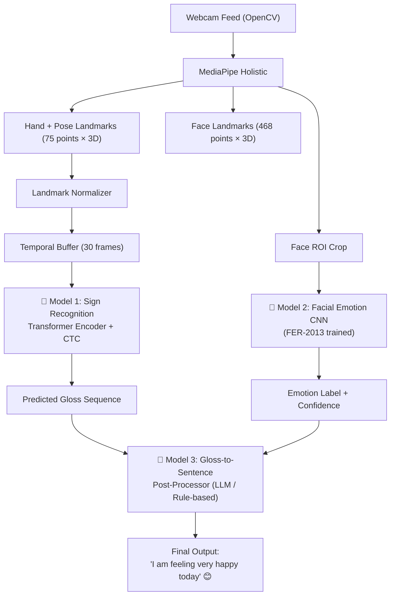
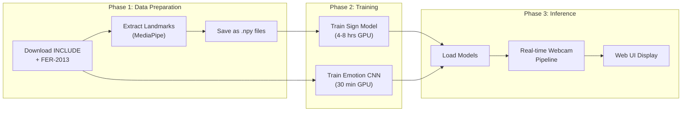

# Advanced ISL Sign Language Detection with Facial Sentiment Analysis

Build a real-time Indian Sign Language (ISL) recognition system that combines **hand/body movement recognition** (word-level signs, not letter-by-letter) with **facial sentiment analysis** to understand the emotional context and produce meaningful, grammatically correct sentences.

---

## Architecture Overview



### Three-Model Pipeline

| Model | Purpose | Architecture | Training Data |
|:------|:--------|:-------------|:-------------|
| **Sign Recognizer** | Recognize ISL word signs from hand/body movements | Transformer Encoder + CTC Loss | INCLUDE (263 signs) + ISL-CSLTR |
| **Emotion Analyzer** | Detect facial emotion for context/sentiment | Mini-CNN (4-layer) | FER-2013 (35K images, 7 emotions) |
| **Sentence Former** | Convert glosses + emotion → natural sentence | Rule-based + Google Gemini API fallback | N/A (inference only) |

---

## Datasets to Download

### 1. INCLUDE Dataset (Primary — Word-Level Signs)

> [!IMPORTANT]
> This is your **primary training dataset** for sign recognition. It contains 263 ISL word signs across 4,287 videos recorded by experienced signers.

- **What**: 263 word-level ISL signs, ~0.27M frames, 4,287 videos
- **Download**: [http://bit.ly/include_dl](http://bit.ly/include_dl) (shell script) or via [European Language Grid](https://live.european-language-grid.eu/catalogue/corpus/7094)
- **Subset**: INCLUDE-50 (50 signs) for rapid prototyping and hyperparameter tuning
- **Why this one**: Largest publicly available word-level ISL dataset with diverse signers

### 2. ISL-CSLTR Dataset (Secondary — Sentence-Level)

> [!TIP]
> Use this to extend to sentence-level recognition after the word-level model is working.

- **What**: 700 annotated videos, 18,863 sentence-level frames, 1,036 word-level images
- **Download**: [Kaggle — ISL-CSLTR](https://www.kaggle.com/datasets/kartiksaxena/islcsltr-indian-sign-language-dataset)
- **Why**: Provides continuous sign language sequences for training temporal models

### 3. FER-2013 Dataset (Facial Emotion)

- **What**: 35,887 grayscale 48×48 face images across 7 emotions (angry, disgust, fear, happy, sad, surprise, neutral)
- **Download**: [Kaggle — FER-2013](https://www.kaggle.com/datasets/msambare/fer2013)
- **Why**: Standard benchmark for facial emotion recognition; lightweight and well-studied

---

## User Review Required

> [!IMPORTANT]
> **Model choice**: I'm recommending a **Transformer Encoder + CTC** architecture over LSTM for the sign recognizer. Transformers handle long-range temporal dependencies better (critical for multi-sign sequences) and train faster with attention parallelism. However, if you have **limited GPU resources** (< 6GB VRAM), I can fall back to a **Bi-LSTM** architecture which is lighter. Which do you prefer?

> [!IMPORTANT]
> **Sentence formation**: For converting glosses to natural language, I plan to use a **hybrid approach**: rule-based templates for common patterns + **Google Gemini API** for complex sentences. This requires an API key. Alternatively, I can build a purely offline rule-based system. Which approach do you prefer?

> [!WARNING]
> **Training time**: Training the sign recognition model on the full INCLUDE dataset (263 signs) will take **4-8 hours on a decent GPU** (RTX 3060+). The FER model trains in ~30 minutes. Do you have GPU access, or should I optimize for CPU training?

## Open Questions

1. **Do you have a GPU available for training?** This determines whether we use the full Transformer architecture or a lighter Bi-LSTM variant.
2. **Do you want a web-based UI or a desktop application?** I'm planning a Flask web app with a modern UI, but can switch to a desktop Tkinter/PyQt app if preferred.
3. **Do you have a Google Gemini API key** for the advanced sentence formation, or should I use a purely offline approach?

---

## Proposed Changes

### Project Structure

```
sign-language-detection2/
├── data/
│   ├── include/              # INCLUDE dataset (downloaded)
│   ├── fer2013/              # FER-2013 dataset (downloaded)
│   └── isl_csltr/            # ISL-CSLTR dataset (downloaded)
├── src/
│   ├── data/
│   │   ├── __init__.py
│   │   ├── landmark_extractor.py    # MediaPipe landmark extraction
│   │   ├── dataset.py               # PyTorch Dataset classes
│   │   └── preprocessing.py         # Normalization, augmentation
│   ├── models/
│   │   ├── __init__.py
│   │   ├── sign_recognizer.py       # Transformer Encoder + CTC
│   │   ├── emotion_cnn.py           # Facial emotion CNN
│   │   └── sentence_former.py       # Gloss → sentence conversion
│   ├── training/
│   │   ├── __init__.py
│   │   ├── train_sign.py            # Training loop for sign model
│   │   └── train_emotion.py         # Training loop for emotion model
│   ├── inference/
│   │   ├── __init__.py
│   │   └── realtime_pipeline.py     # Real-time webcam inference
│   └── utils/
│       ├── __init__.py
│       ├── config.py                # Hyperparameters & paths
│       └── visualization.py         # Drawing utilities
├── app/
│   ├── server.py                    # Flask backend
│   ├── templates/
│   │   └── index.html               # Main UI
│   └── static/
│       ├── css/
│       │   └── style.css            # Styling
│       └── js/
│           └── app.js               # Frontend logic
├── models/                          # Saved model weights
│   ├── sign_recognizer.pth
│   └── emotion_cnn.pth
├── notebooks/
│   └── exploration.ipynb            # Data exploration
├── requirements.txt
├── train.py                         # Main training entry point
├── run.py                           # Main inference entry point
└── README.md
```

---

### Component 1: Data Pipeline

#### [NEW] [landmark_extractor.py](file:///c:/Users/adity/OneDrive/Desktop/Projects/sign-language-detection2/src/data/landmark_extractor.py)

MediaPipe Holistic-based feature extraction:
- Extract **33 pose landmarks** (upper body orientation)
- Extract **21 × 2 = 42 hand landmarks** (both hands, detailed finger articulation)
- Extract **face ROI** crop for emotion model
- Normalize landmarks relative to shoulder center for position invariance
- Output: `(num_frames, 225)` tensor per video — 75 landmarks × 3 coordinates (x, y, z)

#### [NEW] [dataset.py](file:///c:/Users/adity/OneDrive/Desktop/Projects/sign-language-detection2/src/data/dataset.py)

PyTorch Dataset classes:
- `INCLUDEDataset`: Loads pre-extracted landmark sequences, pads/truncates to 30 frames, returns `(sequence, label)` pairs
- `FERDataset`: Loads FER-2013 images, applies augmentation (random flip, rotation, brightness), returns `(image, emotion_label)` pairs

#### [NEW] [preprocessing.py](file:///c:/Users/adity/OneDrive/Desktop/Projects/sign-language-detection2/src/data/preprocessing.py)

- Landmark normalization (zero-center on hip midpoint, scale by shoulder width)
- Temporal augmentation (speed perturbation ±20%, frame dropping)
- Spatial augmentation (random rotation ±15°, random scaling)

---

### Component 2: Sign Recognition Model (Core)

#### [NEW] [sign_recognizer.py](file:///c:/Users/adity/OneDrive/Desktop/Projects/sign-language-detection2/src/models/sign_recognizer.py)

**Architecture: Transformer Encoder with CTC Loss**

```
Input: (batch, seq_len=30, features=225)
    ↓
Linear Embedding (225 → 256)
    ↓
Positional Encoding (sinusoidal)
    ↓
Transformer Encoder (4 layers, 8 heads, d_model=256, d_ff=512)
    ↓
Layer Norm
    ↓
Linear Head (256 → num_classes=263)
    ↓
CTC Loss (handles variable-length sign sequences)
```

**Why Transformer + CTC over LSTM:**
- **Attention mechanism** captures which frames in the sign are most important (e.g., the hand shape at the apex of a movement matters more than transitional frames)
- **CTC loss** handles the alignment problem — we don't need frame-level labels, just the sign label for the whole video
- **Parallelizable** training (much faster than sequential LSTM)
- **Better accuracy** on longer sequences where LSTM suffers from vanishing gradients

---

### Component 3: Facial Emotion Recognition

#### [NEW] [emotion_cnn.py](file:///c:/Users/adity/OneDrive/Desktop/Projects/sign-language-detection2/src/models/emotion_cnn.py)

**Architecture: Lightweight CNN**

```
Input: (batch, 1, 48, 48) grayscale face
    ↓
Conv2d(1→32, 3×3) → BatchNorm → ReLU → MaxPool
    ↓
Conv2d(32→64, 3×3) → BatchNorm → ReLU → MaxPool
    ↓
Conv2d(64→128, 3×3) → BatchNorm → ReLU → MaxPool
    ↓
Conv2d(128→256, 3×3) → BatchNorm → ReLU → AdaptiveAvgPool
    ↓
Dropout(0.5) → Linear(256→128) → ReLU
    ↓
Linear(128→7 emotions)
```

**7 Emotion Classes**: angry, disgust, fear, happy, sad, surprise, neutral

**How emotion enhances sign language understanding:**
- In ISL, facial expressions are **grammatical markers** (e.g., raised eyebrows = question, furrowed brows = negation)
- The same hand sign with different facial expressions can mean different things
- Emotion context helps the sentence former produce more natural output (e.g., "I am happy" vs "I am sad" when the hand sign is "I feel")

---

### Component 4: Sentence Formation

#### [NEW] [sentence_former.py](file:///c:/Users/adity/OneDrive/Desktop/Projects/sign-language-detection2/src/models/sentence_former.py)

**Hybrid approach:**

1. **Rule-based templates** for common ISL → English patterns:
   - ISL follows **SOV (Subject-Object-Verb)** order → convert to English SVO
   - Apply emotion as an adjective/adverb modifier
   - Handle negation markers from facial expressions

2. **Gemini API fallback** for complex sequences:
   - Send gloss sequence + detected emotion to Gemini
   - Prompt: "Convert these ISL glosses to a natural English sentence. The signer's facial expression indicates {emotion}. Glosses: {gloss_sequence}"

---

### Component 5: Real-Time Inference Pipeline

#### [NEW] [realtime_pipeline.py](file:///c:/Users/adity/OneDrive/Desktop/Projects/sign-language-detection2/src/inference/realtime_pipeline.py)

The main inference loop:
1. Capture webcam frame via OpenCV
2. Run MediaPipe Holistic → extract landmarks + face ROI
3. Buffer 30 frames of landmarks
4. Every 30 frames (1 second at 30fps):
   - Feed landmark buffer to Sign Recognizer → get predicted gloss
   - Feed face ROI to Emotion CNN → get emotion label
   - Accumulate glosses into a sentence buffer
5. On "sentence boundary" detection (pause in signing > 1.5s):
   - Send accumulated glosses + dominant emotion to Sentence Former
   - Display final sentence on screen

---

### Component 6: Web Application

#### [NEW] [server.py](file:///c:/Users/adity/OneDrive/Desktop/Projects/sign-language-detection2/app/server.py)

Flask backend:
- `/` — Serve the main UI
- `/api/start` — Start webcam capture and inference
- `/api/stop` — Stop capture
- `/api/stream` — WebSocket/SSE for real-time results
- `/api/status` — Current model status and predictions

#### [NEW] [index.html](file:///c:/Users/adity/OneDrive/Desktop/Projects/sign-language-detection2/app/templates/index.html)

Modern, premium web UI with:
- Live webcam feed with landmark overlay
- Real-time gloss display (word-by-word as they're recognized)
- Emotion indicator with emoji
- Sentence history panel
- Dark mode, glassmorphism, smooth animations

#### [NEW] [style.css](file:///c:/Users/adity/OneDrive/Desktop/Projects/sign-language-detection2/app/static/css/style.css) + [app.js](file:///c:/Users/adity/OneDrive/Desktop/Projects/sign-language-detection2/app/static/js/app.js)

---

### Component 7: Training Scripts

#### [NEW] [train_sign.py](file:///c:/Users/adity/OneDrive/Desktop/Projects/sign-language-detection2/src/training/train_sign.py)

- Load INCLUDE dataset (pre-extracted landmarks)
- Train Transformer Encoder with CTC loss
- Learning rate: 1e-4 with cosine annealing
- Batch size: 32, Epochs: 100 (early stopping patience=10)
- Save best model by validation accuracy

#### [NEW] [train_emotion.py](file:///c:/Users/adity/OneDrive/Desktop/Projects/sign-language-detection2/src/training/train_emotion.py)

- Load FER-2013 dataset
- Train CNN with CrossEntropy loss
- Learning rate: 1e-3 with step decay
- Batch size: 64, Epochs: 50
- Data augmentation: random flip, rotation, brightness jitter

---

## Training & Inference Flow



---

## Verification Plan

### Automated Tests
1. **Unit tests** for landmark extraction, normalization, dataset loading
2. **Model smoke tests**: Forward pass with random data to verify shapes
3. **Training validation**: Monitor loss curves, validate accuracy on held-out set
4. Run `python -m pytest tests/` after each component

### Manual Verification
1. **Sign model accuracy**: Target >70% top-5 accuracy on INCLUDE test set
2. **Emotion model accuracy**: Target >65% on FER-2013 test set (SOTA is ~73%)
3. **Real-time FPS**: Target >15 FPS on webcam inference
4. **End-to-end demo**: Show webcam feed, sign a few ISL words, verify output sentence makes sense
5. **Browser testing**: Verify the web UI works in Chrome/Edge with webcam permissions

---

## Tech Stack Summary

| Component | Technology |
|:----------|:-----------|
| Language | Python 3.10+ |
| Deep Learning | PyTorch 2.x |
| Pose Estimation | MediaPipe Holistic |
| Video Capture | OpenCV |
| Web Backend | Flask + Flask-SocketIO |
| Web Frontend | HTML/CSS/JS (vanilla, premium design) |
| Sentence Formation | Rule-based + Google Gemini API |
| Data Format | NumPy arrays (.npy) for landmarks |
